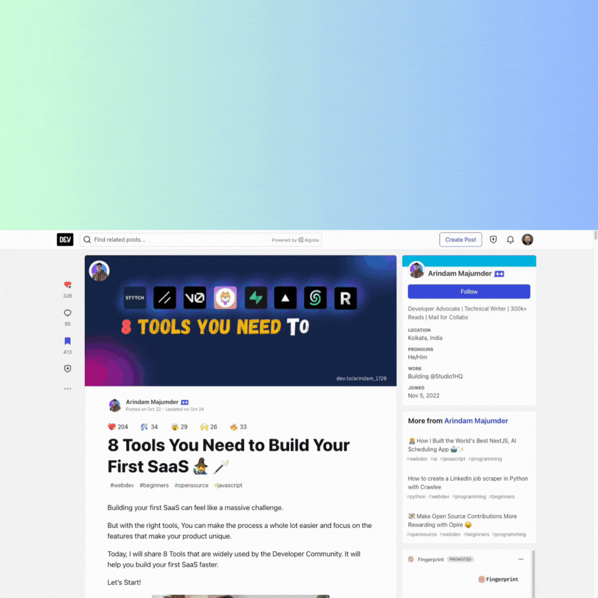

# Dev.to Blog Comments Spam Analyzer

This extension helps you to analyze comments on Dev.to blog posts for overall quality based on their contextual and semantic similarity to each other. It must be paired with the [backend](https://www.github.com/hummusonrails/comments-spam-analyzer-backend), which is a Node.js server that uses [OpenAI](https://openai.com) to generate vector embeddings for the comments on the blog post, and then uses [Couchbase](https://couchbase.com) to store the embeddings and perform a vector similarity search on them and return a ranking of the comments based on that similarity score.

## Usage

You can either install the extension from the Chrome Web Store or install it manually in your browser by following the instructions below:

1. Clone the repository
2. Run `npm install` to install the dependencies
3. Run `npm run build` to build the extension
4. Open the Extension Management page by navigating to `chrome://extensions`
   - The Extension Management page can also be opened by clicking on the Chrome menu, hovering over `More Tools` then selecting `Extensions`
5. Enable Developer Mode by clicking the toggle switch next to Developer mode
6. Click the `Load unpacked` button and select the extension directory

Once you have installed the extension, navigate to any blog post on [Dev.to](https://dev.to) and click on the extension icon in the browser toolbar. You will be prompted to enter the URL of the backend server. Once you have entered the URL of your backend server, it could be run remotely or on localhost, the extension will send a request to the server to analyze the comments on the blog post and display the results in the extension window.

## Development 

This extension was created with [Extension CLI](https://oss.mobilefirst.me/extension-cli/). If you find this software helpful [star](https://github.com/MobileFirstLLC/extension-cli/) or [sponsor](https://github.com/sponsors/MobileFirstLLC) this project.

### Available Commands

| Commands | Description |
| --- | --- |
| `npm run start` | build extension, watch file changes |
| `npm run build` | generate release version |
| `npm run docs` | generate source code docs |
| `npm run clean` | remove temporary files |
| `npm run test` | run unit tests |
| `npm run sync` | update config files |

For CLI instructions see [User Guide &rarr;](https://oss.mobilefirst.me/extension-cli/)

### Learn More

**Extension Developer guides**

- [Getting started with extension development](https://developer.chrome.com/extensions/getstarted)
- Manifest configuration: [version 2](https://developer.chrome.com/extensions/manifest) - [version 3](https://developer.chrome.com/docs/extensions/mv3/intro/)
- [Permissions reference](https://developer.chrome.com/extensions/declare_permissions)
- [Chrome API reference](https://developer.chrome.com/docs/extensions/reference/)

**Extension Publishing Guides**

- [Publishing for Chrome](https://developer.chrome.com/webstore/publish)
- [Publishing for Edge](https://docs.microsoft.com/en-us/microsoft-edge/extensions-chromium/publish/publish-extension)
- [Publishing for Opera addons](https://dev.opera.com/extensions/publishing-guidelines/)
- [Publishing for Firefox](https://extensionworkshop.com/documentation/publish/submitting-an-add-on/)

## License

This project is licensed under the MIT License - see the [LICENSE](LICENSE) file for details.

## Contributing

Please read [CONTRIBUTING.md](CONTRIBUTING.md) for details on our code of conduct, and the process for submitting pull requests to us.
